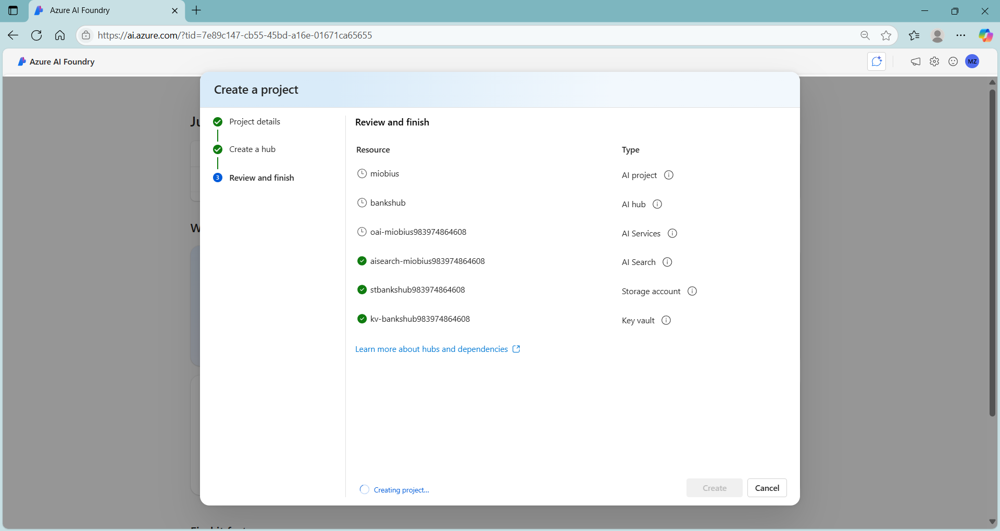
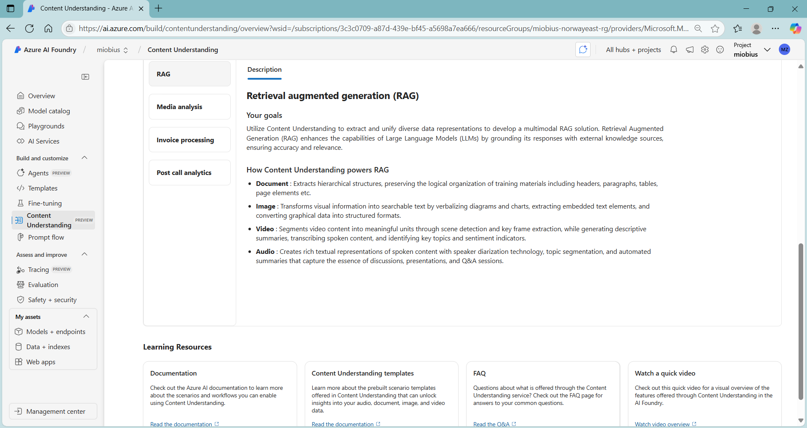
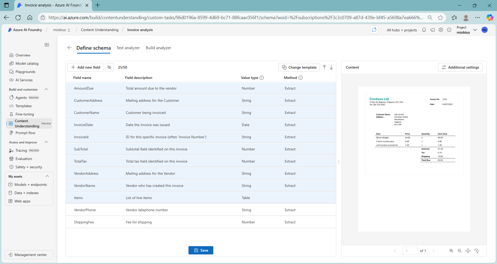
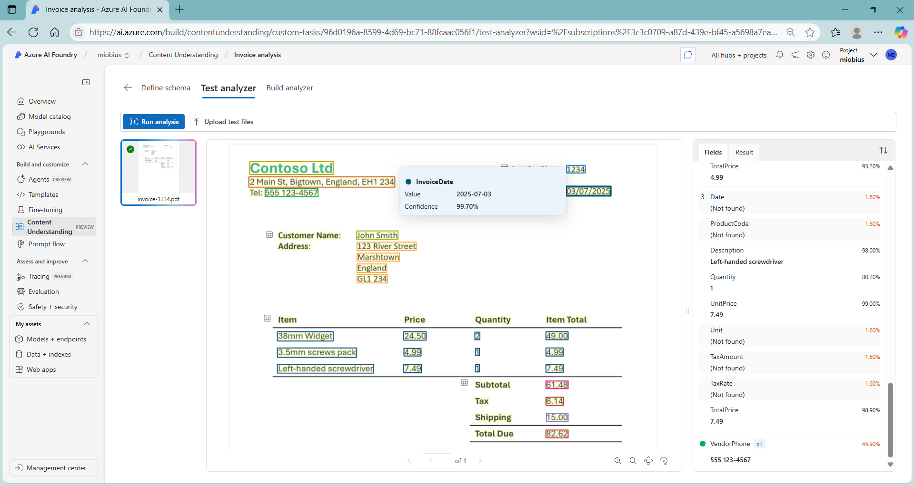
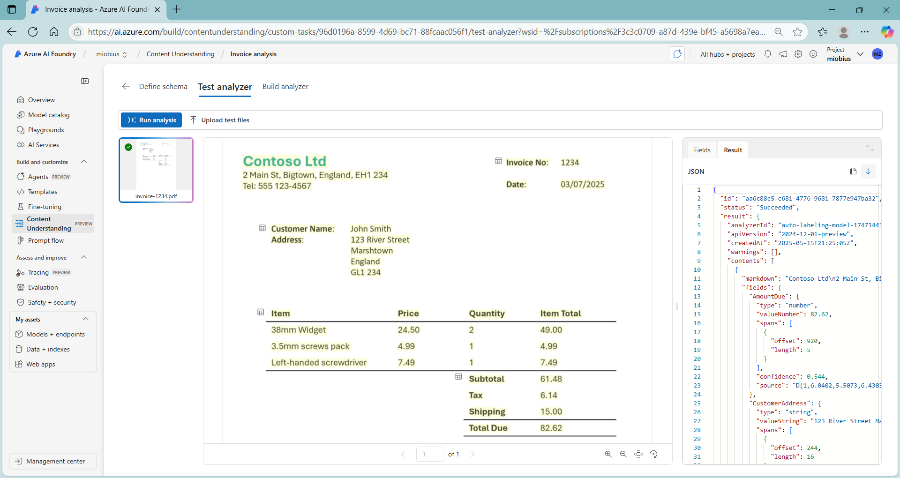
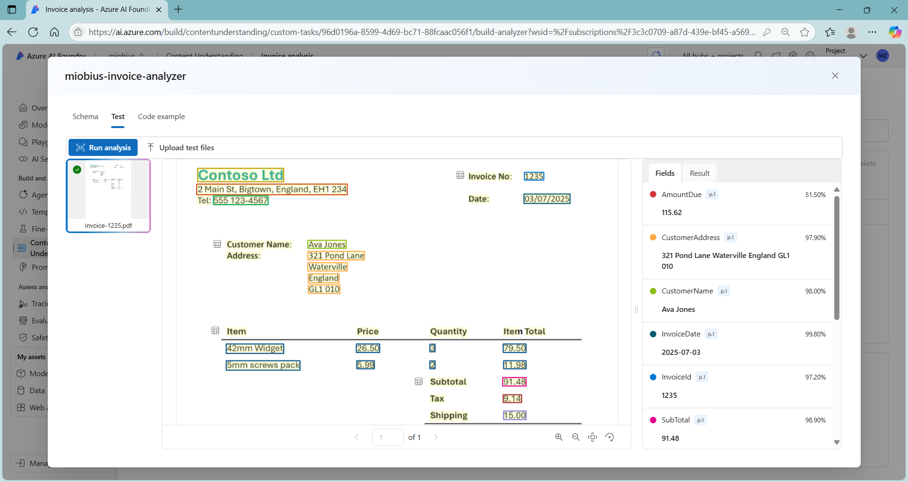
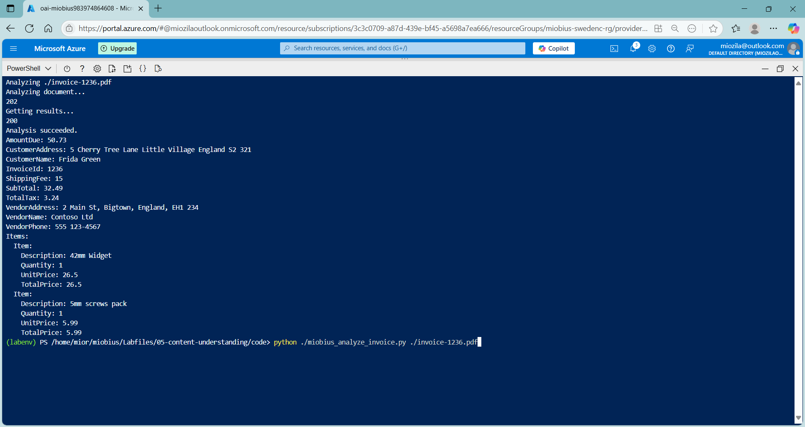

# Miobius
Artificial Intelligent Content Management

## Objective
To analyze & extract data like invoiceID, statementDate, etc. from various content sources like invoices, statements, etc.
Leverage AI Document Intelligence Content Understanding to cater traditional content managent limitation.
To use Content Understanding REST API.

## AI Document Intelligence Content Understanding

